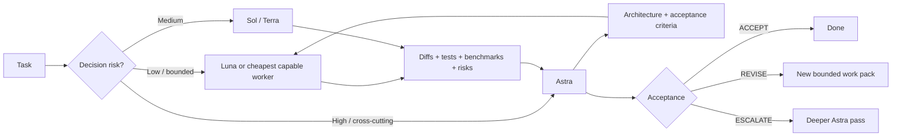

# Astra Quota Router

A small Agent Skill for stretching scarce Astra quota without giving up Astra where it actually matters.

> Keep frontier judgement expensive. Make bounded execution cheap. Bring the evidence back for acceptance.

## Credit

This repository was inspired by the workflow shared in this r/codex post:

**Original thread:** https://www.reddit.com/r/codex/comments/1w9ksnt/how_i_plus_user_dont_run_out_of_astra/

The core idea belongs to the original poster: use the strongest model for the parts that genuinely need it, and push routine execution down to cheaper models instead of burning Astra on everything.

I liked the pattern enough to turn it into a reusable Skill.

This repo does **not** reproduce the Reddit post. It operationalises the idea with explicit routing rules, bounded work packs, evidence contracts, escalation conditions, and a final acceptance loop.

If you are the OP and would like your Reddit handle credited directly here, open an issue or PR and I will add it.

## What the Skill adds

The Reddit idea is simple. The Skill makes it repeatable:

1. Classify work by decision risk.
2. Keep architecture, cross-cutting correctness, security/concurrency judgement, and final acceptance with Astra.
3. Turn implementation into narrow work packs.
4. Send each pack to the cheapest capable tier.
5. Require real evidence back: changed files, diffs, tests, benchmarks, failures, and unresolved risks.
6. Escalate only when the returned evidence shows the cheaper tier is insufficient.
7. Let Astra review the evidence and return `ACCEPT`, `REVISE`, or `ESCALATE`.



## Two useful operating modes

### 1. Astra as root architect

Use when Astra budget is healthy enough to keep the strongest model in the parent session.

Astra:
- defines architecture and invariants;
- creates bounded work packs;
- delegates investigation and implementation;
- reviews actual evidence;
- accepts or rejects the result.

This is the default mode.

### 2. Astra behind a gate

Use when frontier quota is critically scarce.

A cheaper capable model, such as Sol or Terra, coordinates routine work and calls for Astra only when:
- architecture needs to be frozen;
- a high-risk trade-off appears;
- cheaper workers return conflicting evidence;
- security, concurrency, consistency, or trust boundaries are uncertain;
- final acceptance requires frontier judgement.

The Skill does not hard-code a particular quota percentage or token multiplier because those change over time.

## Example

Instead of:

```text
Astra, inspect the whole repo, understand the architecture, implement this feature,
write all the tests, run benchmarks, fix everything you find and review your own work.
```

Use:

```text
Use Astra Quota Router.

I want Astra to remain the root architect and final acceptance authority.
Route repository reconnaissance, routine implementation, tests and benchmarks to
cheaper workers. Give each worker a bounded work pack and require concrete evidence
back. Escalate only if the evidence justifies it.
```

A typical worker pack becomes:

```markdown
## Goal
Add idempotent retry handling to the payment callback.

## Scope
`src/payments/callback.py` and its tests only.

## Constraints
Do not change the public callback contract.
Preserve existing audit events.
Retries must not duplicate external effects.

## Evidence required
- exact diff
- targeted unit/integration tests
- failure-path test proving duplicate callback safety

## Stop conditions
Escalate if the current persistence model cannot support an idempotency key safely.

## Return
Files changed, commands run, results, assumptions, unresolved risks.
```

## Why evidence matters

Delegation only saves quota if the strong model does not redo the worker's job.

So the worker should return **evidence**, not a long narrative:

- files changed;
- diff summary;
- test/build/lint output;
- benchmark method and result where relevant;
- assumptions introduced;
- unresolved failures;
- any scope deviation.

Astra can then spend its quota on judgement rather than rediscovery.

## Installation

This repository follows the Agent Skills format with `SKILL.md` as the entrypoint.

For ChatGPT, Skills can be uploaded from the Skills creation flow where supported by your plan/workspace. OpenAI Skills can also be exported/imported across products that support the Agent Skills format.

For Codex or another Agent Skills compatible runtime, clone/download this repository and install it using that runtime's normal Skill mechanism.

## Files

- `SKILL.md` — the runtime control plane
- `agents/openai.yaml` — OpenAI UI metadata
- `references/work-pack-template.md` — reusable delegation contract
- `references/source-notes.md` — provenance and attribution
- `evals/routing-scenarios.json` — expected routing examples

## What this is not

- It is not an official OpenAI Skill.
- It is not official quota guidance.
- It does not guarantee a specific quota saving.
- It is not a claim that Luna, Sol, Terra, or Astra have fixed relative costs forever.
- It does not make weak models magically suitable for high-risk work.

The useful abstraction is the routing discipline: **scarce judgement, bounded execution, evidence-based escalation, frontier acceptance**.

## Status

Early public version. Feedback and counterexamples are welcome, especially cases where the routing boundary is wrong.

## License

MIT. See `LICENSE`.
